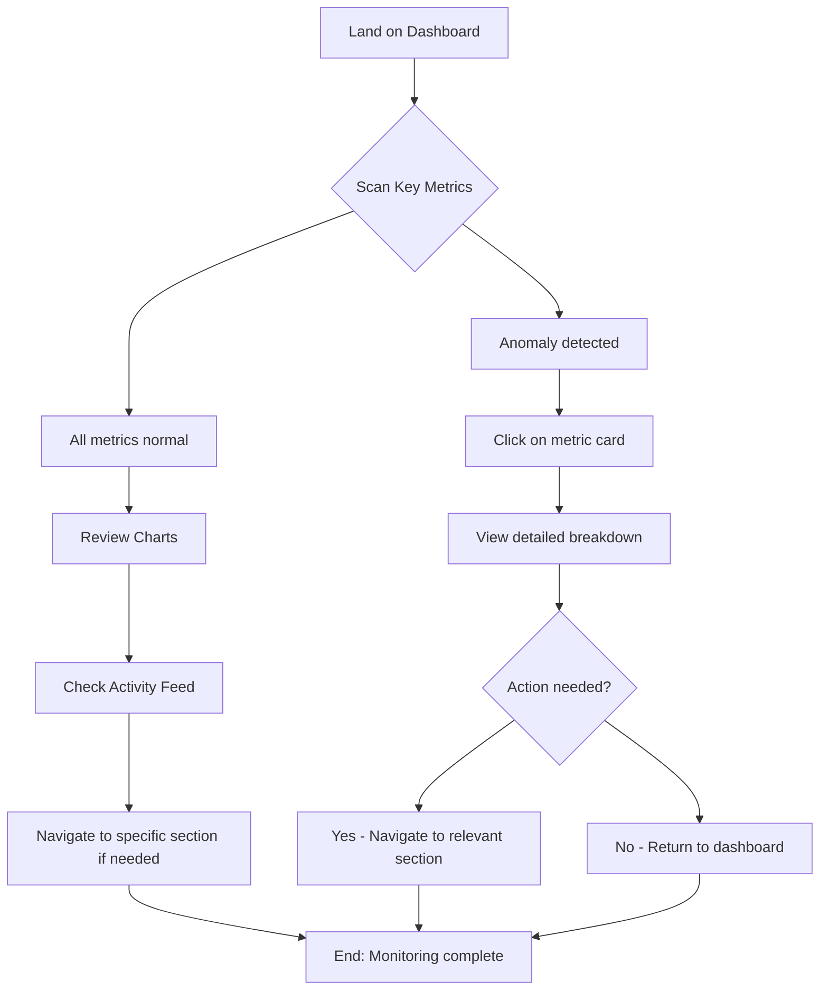
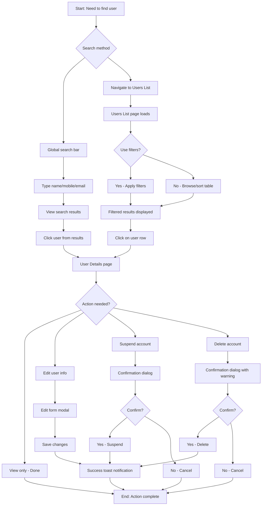
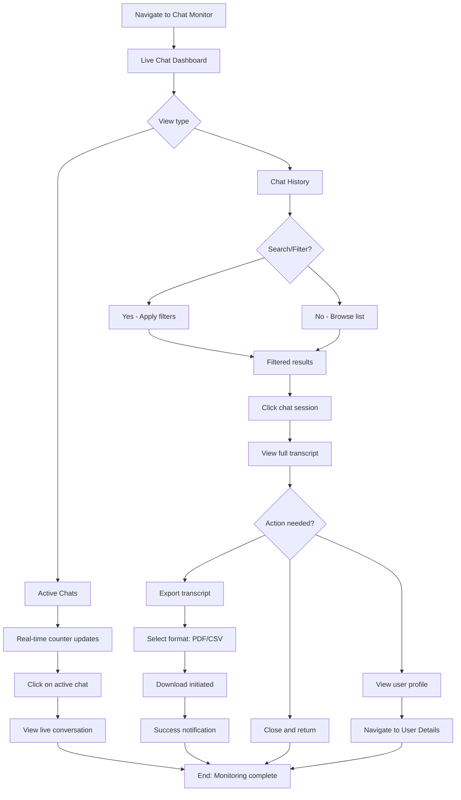
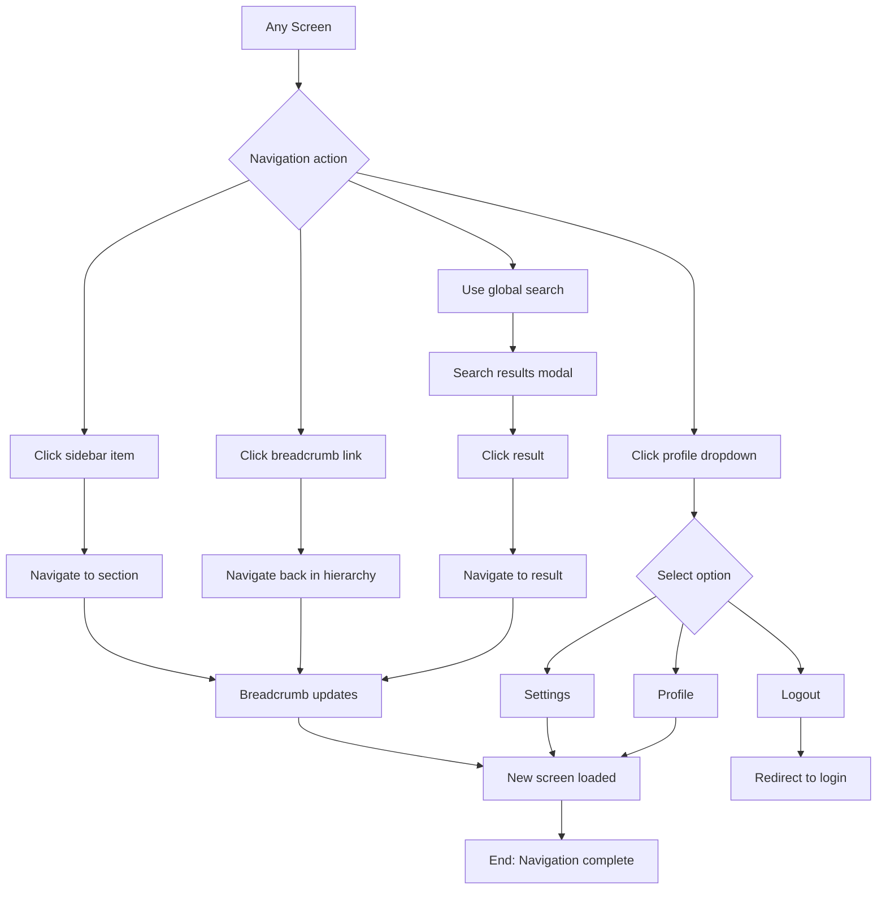

# WealthWarriors Admin Panel UI/UX Specification

**Version:** 1.0
**Last Updated:** 2025-10-15
**Status:** Final Draft
**Author:** Sally (UX Expert)

---

## Table of Contents

1. [Introduction](#introduction)
2. [Information Architecture](#information-architecture)
3. [User Flows](#user-flows)
4. [Wireframes & Mockups](#wireframes--mockups)
5. [Component Library / Design System](#component-library--design-system)
6. [Branding & Style Guide](#branding--style-guide)
7. [Accessibility Requirements](#accessibility-requirements)
8. [Responsiveness Strategy](#responsiveness-strategy)
9. [Animation & Micro-interactions](#animation--micro-interactions)
10. [Performance Considerations](#performance-considerations)
11. [Next Steps](#next-steps)

---

## Introduction

This document defines the user experience goals, information architecture, user flows, and visual design specifications for **WealthWarriors Admin Panel**'s user interface. It serves as the foundation for visual design and frontend development, ensuring a cohesive and user-centered experience.

### Overall UX Goals & Principles

#### Target User Personas

**System Administrator** (25-45 years old)
- **Role:** Platform administrator managing users, content, and system operations
- **Context:** Needs quick access to metrics, user management, and content moderation tools
- **Pain Points:** Information overload, slow navigation, unclear system status, difficulty finding specific users
- **Goals:** Efficient user management, quick problem resolution, clear system health monitoring, easy content moderation

**Content Manager** (28-50 years old)
- **Role:** Content creator/editor managing financial tips, articles, and FAQs
- **Context:** Focuses on content creation, editing, and publishing workflows
- **Pain Points:** Clunky editors, difficulty organizing content, unclear publishing status
- **Goals:** Streamlined content workflows, easy article management, clear draft/publish states

**Analytics Viewer** (30-55 years old)
- **Role:** Business stakeholder reviewing metrics and reports
- **Context:** Needs clear data visualization and export capabilities
- **Pain Points:** Overwhelming data, unclear trends, difficulty exporting reports
- **Goals:** Clear metrics visualization, easy trend identification, flexible export options

#### Usability Goals

1. **Ease of learning:** New admins can navigate to key sections within 2 minutes
2. **Efficiency of use:** Core tasks (user search, status change, view metrics) completed in ≤3 clicks
3. **Error prevention:** Destructive actions (delete, suspend) require explicit confirmation
4. **Memorability:** Infrequent users can return after 2 weeks without relearning navigation
5. **Satisfaction:** Clean, uncluttered interface that reduces cognitive load

#### Design Principles

1. **Data-First Design** - Prioritize clear data presentation over decorative elements
2. **Progressive Disclosure** - Show summary data first, details on demand
3. **Consistent Patterns** - Reuse table, filter, and action patterns across all sections
4. **Immediate Feedback** - Every action (save, delete, update) shows instant confirmation
5. **Mobile-Responsive** - Full functionality on tablets, core functions on mobile

#### Change Log

| Date | Version | Description | Author |
|------|---------|-------------|--------|
| 2025-10-15 | 1.0 | Initial specification created | Sally (UX Expert) |

---

## Information Architecture

### Site Map / Screen Inventory

```mermaid
graph TD
    A[Admin Panel] --> B[Dashboard Home]
    A --> C[User Management]
    A --> D[Chat Monitor]
    A --> E[Content Management]
    A --> F[Analytics & Reports]
    A --> G[System Settings]

    B --> B1[Key Metrics Cards]
    B --> B2[Growth Charts]
    B --> B3[Activity Feed]

    C --> C1[Users List]
    C --> C2[User Details]
    C --> C3[User Activity Timeline]
    C --> C4[Bulk Actions]

    D --> D1[Live Chat Dashboard]
    D --> D2[Chat History]
    D --> D3[Chat Transcript View]

    E --> E1[Articles Management]
    E --> E2[Article Editor]
    E --> E3[FAQ Management]
    E --> E4[Media Library]

    F --> F1[User Reports]
    F --> F2[Engagement Reports]
    F --> F3[Financial Reports]
    F --> F4[Export Center]

    G --> G1[App Settings]
    G --> G2[Admin Users]
    G --> G3[Security Settings]
    G --> G4[Feature Flags]
```



### Navigation Structure

**Primary Navigation:**
Persistent left sidebar (collapsible on mobile/tablet) with icon + label menu items. Always visible on desktop, hamburger menu on mobile. Sections include:
- 📊 Dashboard (home)
- 👥 Users
- 💬 Chat Monitor
- 📝 Content
- 📈 Analytics
- ⚙️ Settings

**Secondary Navigation:**
- **In-page tabs** for complex sections (e.g., User Reports → Growth | Retention | Churn tabs)
- **Action buttons** in top-right of content area (e.g., "Add User", "Export", "New Article")
- **Filter panels** that slide in from right for data-heavy screens (Users List, Chat History)

**Breadcrumb Strategy:**
Breadcrumbs appear below the header bar for nested screens:
- Format: `Dashboard > Users > User Details > John Doe`
- Clickable path for easy backtracking
- Hidden on mobile to save space (use back button instead)

### Top Header Bar Layout

```
┌────────────────────────────────────────────────────────────┐
│ [☰] WealthWarriors Admin    [Search...]  [🔔] [Profile ▾] │
└────────────────────────────────────────────────────────────┘
```

**Components:**
- **Left:** Hamburger menu (mobile/tablet), Logo/Brand name
- **Center:** Global search bar (searches users, content, chat sessions)
- **Right:** Notifications bell icon (with badge count), Admin profile dropdown (logout, settings, profile)

### Dashboard Home Layout

```
┌─────────────────────────────────────────────────────┐
│  Key Metrics Cards (4 columns)                      │
│  ┌──────┐ ┌──────┐ ┌──────┐ ┌──────┐              │
│  │Total │ │Active│ │Chat  │ │System│              │
│  │Users │ │Users │ │Sess. │ │Health│              │
│  └──────┘ └──────┘ └──────┘ └──────┘              │
├─────────────────────────────────────────────────────┤
│  Charts Section (2 columns)                         │
│  ┌──────────────────┐ ┌──────────────────┐         │
│  │ User Growth      │ │ Chat Activity    │         │
│  │ (Line Chart)     │ │ (Bar Chart)      │         │
│  └──────────────────┘ └──────────────────┘         │
│  ┌──────────────────┐ ┌──────────────────┐         │
│  │ Registration     │ │ Peak Usage Hours │         │
│  │ Sources (Pie)    │ │ (Heatmap)        │         │
│  └──────────────────┘ └──────────────────┘         │
├─────────────────────────────────────────────────────┤
│  Recent Activity Feed                               │
│  • User registration, chat sessions, alerts         │
└─────────────────────────────────────────────────────┘
```

---

## User Flows

### Flow 1: Dashboard Overview & Monitoring

**User Goal:** Quickly assess system health and recent activity upon login

**Entry Points:**
- Direct login to admin panel (lands on Dashboard)
- Clicking "Dashboard" in sidebar from any other section

**Success Criteria:**
- Admin can identify key metrics within 5 seconds
- Admin can spot anomalies or alerts immediately
- Admin can drill into details from any metric card

#### Flow Diagram



#### Edge Cases & Error Handling:

- **No data available:** Show empty state with message "No data yet" and illustration
- **API failure:** Show cached data with warning banner "Data may be outdated - refresh in progress"
- **Slow loading:** Display skeleton loaders for cards and charts (never show blank screen)
- **WebSocket disconnection:** Activity feed shows "Reconnecting..." status, auto-retry every 5 seconds

**Notes:** Real-time updates via WebSocket should be throttled to prevent UI jank. Consider batching updates every 3-5 seconds rather than instant updates.

---

### Flow 2: User Search & Management

**User Goal:** Find a specific user and take action (view details, suspend, etc.)

**Entry Points:**
- Global search bar in header
- Navigate to Users section via sidebar
- Click user link from Activity Feed or Reports

**Success Criteria:**
- Admin can find any user in ≤10 seconds
- Admin can perform common actions (view, suspend, delete) in ≤3 clicks
- Admin receives clear confirmation after actions

#### Flow Diagram



#### Edge Cases & Error Handling:

- **No search results:** Show "No users found" with suggestion to check spelling or try different terms
- **Multiple users with similar names:** Display all matches with distinguishing info (mobile, email, ID)
- **User already suspended:** Disable "Suspend" button, show "Activate" button instead
- **Delete fails (active sessions):** Show error "Cannot delete user with active chat sessions. Suspend instead?"
- **Network error during action:** Show retry option with clear error message
- **Bulk actions on 0 users selected:** Disable bulk action buttons with tooltip "Select users first"

**Notes:** Consider debouncing search input (300ms delay) to reduce API calls. Table sorting/filtering should happen client-side if dataset is <1000 users, server-side for larger datasets.

---

### Flow 3: Viewing Chat Sessions

**User Goal:** Monitor live chats and review chat history for insights or support

**Entry Points:**
- Navigate to Chat Monitor via sidebar
- Click chat metric card on Dashboard
- Click chat session from Activity Feed

**Success Criteria:**
- Admin can see active chats immediately
- Admin can search and filter historical chats
- Admin can export chat transcripts

#### Flow Diagram



#### Edge Cases & Error Handling:

- **No active chats:** Show illustration with "No active chats right now - all quiet! ✨"
- **WebSocket failure:** Fallback to polling every 10 seconds with warning banner
- **Export large transcript:** Show progress indicator, generate async if >1000 messages
- **Transcript unavailable (retention policy):** Show "Transcript expired (90+ days old)"
- **Filter returns no results:** Show "No chats match these filters" with "Clear filters" button

**Notes:** Consider privacy implications - admins should see transcripts but not edit them. Add audit logging for who viewed which chats.

---

### Flow 4: Quick Navigation Flow

**User Goal:** Efficiently navigate between sections without losing context

**Entry Points:** Any screen in admin panel

**Success Criteria:**
- Admin can reach any main section in 1 click
- Admin can return to Dashboard in 1 click
- Breadcrumbs provide context and quick navigation

#### Flow Diagram



#### Edge Cases & Error Handling:

- **Navigation during unsaved changes:** Show confirmation dialog "Unsaved changes will be lost. Continue?"
- **Slow page load:** Show loading skeleton for new section
- **404/unauthorized section:** Redirect to Dashboard with error toast "You don't have access to this section"
- **Sidebar collapsed on mobile:** Ensure hamburger menu is always accessible

**Notes:** Consider implementing keyboard shortcuts (e.g., `Cmd+K` for global search, `Cmd+/` for sidebar focus) for power users.

---

## Wireframes & Mockups

### Primary Design Files

**Design Tool:** Figma (recommended)
**File Structure:**
- `WealthWarriors-Admin-Panel-Wireframes.fig` - Low-fidelity layouts
- `WealthWarriors-Admin-Panel-UI-Kit.fig` - Component library and design system
- `WealthWarriors-Admin-Panel-High-Fidelity.fig` - Final mockups with real data

**Design File Link:** _(To be created - placeholder for Figma project URL)_

---

### Key Screen Layouts

#### Screen 1: Main Layout Structure

**Purpose:** Define the persistent layout that wraps all admin screens

**Key Elements:**

```
┌─────────────────────────────────────────────────────────────┐
│  HEADER BAR (h: 64px, bg: white, shadow)                   │
│  [☰] WealthWarriors Admin    [Search...]  [🔔] [Profile ▾] │
└─────────────────────────────────────────────────────────────┘
┌──────┬──────────────────────────────────────────────────────┐
│      │  BREADCRUMB (h: 40px, bg: light-gray)               │
│      │  Dashboard > Users > User Details                    │
│ SIDE ├──────────────────────────────────────────────────────┤
│ BAR  │                                                       │
│      │                                                       │
│ (w:  │             MAIN CONTENT AREA                        │
│ 240  │           (bg: light-gray #f9fafb)                   │
│ px)  │          (padding: 24px)                             │
│      │                                                       │
│      │                                                       │
│      │                                                       │
│      │                                                       │
└──────┴──────────────────────────────────────────────────────┘
```

**Layout Specifications:**
- **Sidebar Width:** 240px (desktop), 0px collapsed (mobile) with 60px icon-only option
- **Header Height:** 64px fixed
- **Breadcrumb Height:** 40px (hidden on mobile)
- **Content Padding:** 24px all sides (16px on mobile)
- **Max Content Width:** 1400px centered (for ultra-wide screens)
- **Sidebar Z-index:** 100 (overlay on mobile)
- **Header Z-index:** 200 (always on top)

**Interaction Notes:**
- Sidebar collapses to icon-only on tablet (60px width)
- Sidebar slides in/out as overlay on mobile with backdrop
- Header remains sticky on scroll
- Breadcrumb scrolls away on mobile to save space

**Responsive Behavior:**
- **Mobile (<768px):** Sidebar hidden, hamburger menu, no breadcrumb
- **Tablet (768-1024px):** Icon-only sidebar (60px), collapsible to full width
- **Desktop (>1024px):** Full sidebar (240px), all elements visible

**Design File Reference:** `Main-Layout-Structure` frame

---

#### Screen 2: Dashboard Home

**Purpose:** Provide at-a-glance system overview with key metrics and activity

**Component Specifications:**

**1. Metric Card:**
- **Size:** Min-height: 120px, flexible width
- **Structure:**
  - Label (14px, gray-600, top)
  - Value (32px, bold, gray-900, center)
  - Change indicator (14px, green/red with arrow, bottom)
- **States:** Default, Loading (skeleton), Error (show "--")
- **Interaction:** Clickable → drills into detailed view
- **Visual:** White background, subtle shadow, 8px border-radius

**2. Chart Cards:**
- **Size:** Min-height: 300px, aspect ratio 16:9
- **Structure:**
  - Title (16px, bold, top-left)
  - Time range selector (top-right, dropdown)
  - Chart area (Recharts component)
  - Legend (bottom)
- **States:** Default, Loading (skeleton), No Data (illustration)
- **Interaction:** Hover tooltips on data points, click to expand
- **Visual:** White background, subtle shadow, 8px border-radius

**3. Activity Feed:**
- **Size:** Min-height: 200px, max 5 items visible
- **Structure:**
  - Header with "View All" link
  - List of activity items (icon + text + timestamp)
  - "Load More" button at bottom
- **States:** Default, Loading (skeleton), Empty (illustration)
- **Interaction:** Real-time updates via WebSocket, click item to navigate
- **Visual:** White background, subtle shadow, 8px border-radius

**Spacing & Grid:**
- **Section gaps:** 24px vertical spacing between metric row, charts, and activity feed
- **Card gaps:** 16px horizontal and vertical gaps between cards
- **Inner padding:** 20px padding inside each card

**Interaction Notes:**
- Metric cards have hover effect (slight scale up, stronger shadow)
- Charts are interactive with tooltips on hover
- Activity feed auto-updates every 5 seconds with smooth fade-in animation
- "View All" links navigate to detailed sections
- All cards have loading skeletons (never show empty white boxes)

**Responsive Behavior:**
- **Mobile (<768px):** Stack all elements (1 column), metric cards 2x2 grid, charts full-width
- **Tablet (768-1024px):** Metric cards 4 columns, charts 1 column stacked
- **Desktop (>1024px):** Layout as shown above (4 col metrics, 2x2 charts)

**Design File Reference:** `Dashboard-Home` frame

---

#### Screen 3: Sidebar Navigation

**Purpose:** Primary navigation hub with clear visual hierarchy

**Component Specifications:**

**Menu Item:**
- **Size:** Height: 44px, full width
- **Structure:**
  - Icon (20px, left aligned with 16px padding)
  - Label (14px, medium weight, 12px left of icon)
  - Badge (optional, right aligned, for notifications)
- **States:**
  - Default: Gray-700 text, transparent background
  - Hover: Gray-900 text, gray-50 background
  - Active: Blue-600 text, blue-50 background, blue left border (4px)
- **Visual:** 6px border-radius, smooth transition (150ms)

**Collapsed State (Icon-only):**
- **Width:** 60px
- **Menu Item:** Center-aligned icon only, tooltip on hover
- **Logo:** Shows icon only (WW monogram)

**Interaction Notes:**
- Click menu item to navigate (no page reload, SPA routing)
- Active state persists based on current route
- Hover shows tooltip in collapsed mode
- Smooth expand/collapse animation (250ms ease-in-out)
- Badge notifications pulse gently for attention

**Design File Reference:** `Sidebar-Navigation-States` frame

---

#### Screen 4: Header Bar

**Purpose:** Global utilities and admin context

**Component Specifications:**

**1. Hamburger Menu (Mobile only):**
- **Size:** 40x40px tap target
- **Icon:** 24px hamburger → X animation on toggle
- **State:** Visible <768px only

**2. Brand/Logo:**
- **Size:** Auto height (fit to 64px header)
- **Text:** "WealthWarriors Admin" (16px, semibold)
- **Behavior:** Clickable → returns to Dashboard

**3. Global Search:**
- **Size:** Width: 300px (desktop), expands on focus to 400px
- **Structure:**
  - Search icon (left, 20px)
  - Input field (placeholder: "Search users, content...")
  - Keyboard shortcut hint (right, "⌘K" grayed out)
- **States:** Default, Focused (blue border), Loading (spinner)
- **Interaction:**
  - Click or ⌘K to focus
  - Debounced search (300ms)
  - Results in dropdown modal (max 10 results per category)
  - ESC to close
- **Mobile:** Collapses to icon, expands to full-width overlay on click

**4. Notifications Bell:**
- **Size:** 40x40px tap target
- **Icon:** Bell (20px)
- **Badge:** Red circle with count (max "9+")
- **Interaction:**
  - Click → dropdown panel (right-aligned, 320px wide)
  - Shows last 10 notifications
  - "View All" link at bottom
  - Real-time updates via WebSocket

**5. Profile Dropdown:**
- **Size:** Auto width, 40px height
- **Structure:**
  - Avatar (32px circle) or initials
  - Name (14px, truncate if long)
  - Dropdown icon (chevron down)
- **Interaction:**
  - Click → dropdown menu (right-aligned)
  - Options: Profile, Settings, Logout
  - Click outside to close

**Visual Design:**
- **Background:** White (#ffffff)
- **Border:** Bottom border (1px, gray-200)
- **Shadow:** Subtle shadow (0 1px 3px rgba(0,0,0,0.1))
- **Height:** 64px fixed

**Design File Reference:** `Header-Bar-Components` frame

---

## Component Library / Design System

### Design System Approach

**Framework:** Build custom component library based on **Shadcn/ui** + **Tailwind CSS**

**Rationale:**
- Shadcn/ui provides unstyled, accessible primitives (copy-paste, not npm dependency)
- Tailwind enables rapid customization and consistency
- Avoids heavy component library bloat (Ant Design, Material-UI)
- Full control over styling while maintaining accessibility standards

**Component Strategy:**
- Start with Shadcn/ui base components (Button, Input, Table, Dialog, etc.)
- Customize with WealthWarriors brand colors and spacing
- Build domain-specific components (MetricCard, ActivityFeedItem, etc.)
- Document in Storybook for team reference

**File Structure:**
```
src/components/
├── ui/                  # Base Shadcn components
│   ├── button.tsx
│   ├── input.tsx
│   ├── table.tsx
│   └── ...
├── admin/               # Domain-specific components
│   ├── MetricCard.tsx
│   ├── ActivityFeed.tsx
│   ├── UserTable.tsx
│   └── ...
└── layouts/             # Layout components
    ├── AdminLayout.tsx
    ├── Sidebar.tsx
    └── Header.tsx
```

---

### Core Components

#### Component 1: Button

**Purpose:** Primary action trigger used throughout the admin panel

**Variants:**
- **Primary:** Solid blue background, white text (main CTAs)
- **Secondary:** Gray outline, gray text (secondary actions)
- **Danger:** Red background, white text (destructive actions)
- **Ghost:** Transparent background, colored text (tertiary actions)
- **Link:** Text only, underline on hover (inline links)

**States:**
- **Default:** Base styling per variant
- **Hover:** Darker shade, subtle scale (1.02x)
- **Active:** Even darker, pressed effect
- **Disabled:** 50% opacity, no pointer events, grayed out
- **Loading:** Spinner icon replacing text, disabled state

**Sizes:**
- **Small:** Height 32px, padding 8px 12px, text 12px
- **Medium:** Height 40px, padding 10px 16px, text 14px (default)
- **Large:** Height 48px, padding 12px 24px, text 16px

**Usage Guidelines:**
- Use Primary for main actions (Save, Create, Submit)
- Use Secondary for cancel/back actions
- Use Danger for delete/suspend actions (always require confirmation)
- Limit to 1-2 primary buttons per screen
- Button text should be action-oriented (verb + noun: "Add User", not "Add")

---

#### Component 2: Input Field

**Purpose:** Text input for forms and search functionality

**Variants:**
- **Text:** Standard text input
- **Number:** Numeric input with up/down arrows
- **Email:** Email validation pattern
- **Search:** With search icon, clear button
- **Password:** Toggle visibility icon

**States:**
- **Default:** Gray border, white background
- **Focus:** Blue border (2px), blue ring shadow
- **Error:** Red border, error message below
- **Disabled:** Gray background, no interaction
- **Success:** Green border (after validation)

**Sizes:**
- **Small:** Height 32px, text 12px
- **Medium:** Height 40px, text 14px (default)
- **Large:** Height 48px, text 16px

**Elements:**
- **Label:** Above input (optional), 14px semibold
- **Placeholder:** Gray-400 text
- **Helper Text:** Below input, 12px gray-500
- **Error Message:** Below input, 12px red-500
- **Prefix/Suffix Icons:** Inside input (20px)

**Usage Guidelines:**
- Always provide labels (accessibility)
- Use placeholder for examples, not instructions
- Show error messages immediately on blur (not on every keystroke)
- Success state only for critical validations (password strength, email format)
- Disable autocomplete for sensitive fields

---

#### Component 3: Table

**Purpose:** Display structured data with sorting, filtering, and actions

**Variants:**
- **Standard:** Basic table with rows and columns
- **Striped:** Alternating row colors for readability
- **Compact:** Reduced padding for dense data
- **Hoverable:** Row highlight on hover

**Features:**
- **Sortable Columns:** Click header to sort (asc/desc/none)
- **Column Resize:** Drag column borders to resize
- **Row Selection:** Checkbox column for bulk actions
- **Pagination:** Footer with page numbers and size selector
- **Empty State:** Illustration and message when no data

**States:**
- **Loading:** Skeleton rows (5-10 placeholders)
- **Error:** Error message with retry button
- **Empty:** Custom empty state with illustration
- **Selected Rows:** Highlighted background (blue-50)

**Usage Guidelines:**
- Limit visible columns to 5-7 (hide less important columns on mobile)
- Always provide sort on at least name/date columns
- Action column should be right-aligned and fixed width
- Use ellipsis for long text with tooltip on hover
- Bulk actions bar appears only when rows are selected
- Default page size: 50 items (configurable: 25, 50, 100)

---

#### Component 4: MetricCard

**Purpose:** Display key performance indicators on dashboard

**Variants:**
- **Default:** White background, standard shadow
- **Featured:** Colored border-left accent (4px)
- **Alert:** Red/yellow background tint for warnings

**Elements:**
- **Icon (optional):** Top-left corner (32px circle, colored background)
- **Label:** Descriptive text
- **Value:** Main metric (large, bold)
- **Change Indicator:** Arrow + percentage + comparison text
- **Sparkline (optional):** Mini chart showing trend

**Usage Guidelines:**
- Keep labels concise (2-3 words max)
- Format large numbers with commas (12,450 not 12450)
- Always show trend direction (up/down arrow)
- Use green for positive trends, red for negative (except metrics where down is good)
- Make entire card clickable to drill into details

---

#### Component 5: ActivityFeedItem

**Purpose:** Display real-time activity events in the dashboard feed

**Elements:**
- **Icon:** Event type indicator (emoji or SVG icon, 20px)
- **Text:** Activity description (14px, truncate long text)
- **Timestamp:** Relative time (gray-500, 12px, right-aligned)
- **Action Link (optional):** Clickable name or "View Details" link

**Event Types:**
- **User Event:** 🟢 Green dot (registration, login)
- **Chat Event:** 💬 Blue speech bubble (session start/end)
- **System Event:** ⚙️ Gray gear (config change)
- **Alert:** ⚠️ Yellow warning (errors, anomalies)
- **Admin Action:** 👤 User icon (suspend, delete)

**States:**
- **Default:** Standard display
- **New:** Pulse animation for fresh events (first 5 seconds)
- **Hover:** Background highlight (gray-50)
- **Clickable:** Cursor pointer, underline on hover

**Usage Guidelines:**
- Limit description to single line (truncate with "...")
- Use relative timestamps ("2 mins ago" not exact time)
- Update timestamps every minute (don't require page refresh)
- Group similar events ("3 new users registered" instead of 3 separate items)
- Fade in new items smoothly (300ms animation)

---

#### Component 6: Modal/Dialog

**Purpose:** Display overlay content for confirmations, forms, and detailed views

**Variants:**
- **Small:** Width 400px (confirmations)
- **Medium:** Width 600px (forms) - default
- **Large:** Width 900px (detailed content)
- **Full:** Full screen (complex workflows)

**Elements:**
- **Header:** Title (18px bold) + close button (top-right)
- **Body:** Scrollable content area (max-height: 70vh)
- **Footer:** Action buttons (right-aligned)
- **Backdrop:** Dark overlay (opacity 50%, click to close)

**States:**
- **Opening:** Fade in + scale up (200ms)
- **Closing:** Fade out + scale down (200ms)
- **Loading:** Overlay spinner while processing

**Usage Guidelines:**
- Always provide close button (X) and ESC key handling
- Primary action on right, cancel on left
- Use modals sparingly (prefer inline editing when possible)
- Disable body scroll when modal is open
- Focus management: trap focus inside modal, return focus on close
- Confirmation modals should clearly state consequences

---

#### Component 7: Badge/Tag

**Purpose:** Display status, categories, or metadata labels

**Variants:**
- **Default:** Gray background (neutral info)
- **Success:** Green background (active, approved)
- **Warning:** Yellow background (pending, caution)
- **Danger:** Red background (suspended, error)
- **Info:** Blue background (informational)

**Sizes:**
- **Small:** Height 20px, text 11px, padding 4px 8px
- **Medium:** Height 24px, text 12px, padding 6px 10px (default)
- **Large:** Height 28px, text 14px, padding 8px 12px

**States:**
- **Static:** Non-interactive label
- **Interactive:** Hover effect, clickable (for filtering)
- **Removable:** X icon for dismissing (tag input)

**Usage Guidelines:**
- Use consistent colors for status (green = active, red = suspended)
- Keep text short (1-2 words: "Active", "Pending")
- Use sentence case ("Active" not "ACTIVE")
- Don't overuse - too many badges creates noise
- Position near related content (next to user name, in table cells)

---

#### Component 8: Toast Notification

**Purpose:** Provide temporary feedback for user actions

**Variants:**
- **Success:** Green with checkmark icon
- **Error:** Red with X icon
- **Warning:** Yellow with warning icon
- **Info:** Blue with info icon

**Behavior:**
- **Position:** Top-right corner (desktop), top-center (mobile)
- **Duration:** 4 seconds (success/info), 6 seconds (warning/error)
- **Animation:** Slide in from right, fade out
- **Dismissible:** Click X or swipe right to dismiss
- **Stacking:** Multiple toasts stack vertically (max 3 visible)

**Usage Guidelines:**
- Show toast for all CRUD operations (create, update, delete)
- Keep messages concise (one sentence)
- Use action-oriented language ("User deleted" not "The user has been deleted")
- Don't show toast for navigation (only for data changes)
- Error toasts should stay until dismissed (don't auto-hide)

---

## Branding & Style Guide

### Visual Identity

**Brand Guidelines:** WealthWarriors Admin Panel follows the parent brand guidelines with adaptations for professional admin interfaces.

**Design Language:**
- **Modern & Clean:** Emphasis on data clarity over decorative elements
- **Professional:** Business-focused aesthetic suitable for financial services
- **Accessible:** WCAG 2.1 AA compliant colors and typography
- **Consistent:** Systematic use of colors, typography, and spacing

**Brand Personality:**
- Trustworthy and reliable (financial services context)
- Efficient and data-driven (admin productivity focus)
- Modern but not trendy (longevity over fashion)

---

### Color Palette

| Color Type | Hex Code | RGB | Usage |
|------------|----------|-----|-------|
| **Primary** | `#2563eb` | rgb(37, 99, 235) | Primary actions, links, active states, brand accent |
| **Primary Hover** | `#1d4ed8` | rgb(29, 78, 216) | Hover state for primary buttons and interactive elements |
| **Success** | `#10b981` | rgb(16, 185, 129) | Confirmations, positive metrics, active status badges |
| **Warning** | `#f59e0b` | rgb(245, 158, 11) | Warnings, pending states, caution indicators |
| **Danger** | `#ef4444` | rgb(239, 68, 68) | Errors, delete actions, critical alerts, suspended status |
| **Info** | `#3b82f6` | rgb(59, 130, 246) | Informational messages, tooltips, neutral notifications |
| **Neutral Gray 900** | `#111827` | rgb(17, 24, 39) | Primary text, headings |
| **Neutral Gray 700** | `#374151` | rgb(55, 65, 81) | Secondary text, body copy |
| **Neutral Gray 500** | `#6b7280` | rgb(107, 114, 128) | Tertiary text, captions, placeholders |
| **Neutral Gray 300** | `#d1d5db` | rgb(209, 213, 219) | Borders, dividers |
| **Neutral Gray 100** | `#f3f4f6` | rgb(243, 244, 246) | Subtle backgrounds, disabled states |
| **Neutral Gray 50** | `#f9fafb` | rgb(249, 250, 251) | Page background, card hover states |
| **White** | `#ffffff` | rgb(255, 255, 255) | Card backgrounds, header, sidebar |

**Color Usage Rules:**
- **Primary blue** for all interactive elements (buttons, links, focus states)
- **Success green** only for positive feedback (not for decorative purposes)
- **Danger red** requires confirmation dialogs (never direct destructive actions)
- **Warning yellow** with dark text overlay (ensure 4.5:1 contrast ratio)
- **Neutral grays** follow semantic hierarchy (900 → 50 = darkest → lightest)

**Accessibility Notes:**
- All text on colored backgrounds meets WCAG AA contrast requirements (4.5:1 for normal text, 3:1 for large text)
- Primary blue on white: 7.8:1 contrast ratio ✓
- Success green on white: 3.1:1 (use only for large text 18px+ or icons)
- Danger red on white: 4.9:1 contrast ratio ✓

---

### Typography

#### Font Families

- **Primary:** Inter (sans-serif)
  - Loaded from Google Fonts, self-hosted for performance
  - Weights used: 400 (Regular), 500 (Medium), 600 (Semibold), 700 (Bold)
  - Fallback: -apple-system, BlinkMacSystemFont, "Segoe UI", sans-serif

- **Secondary:** SF Pro Display (Apple devices), Inter (fallback)
  - Used for headings on macOS/iOS for native feel
  - Automatic fallback to Inter on other platforms

- **Monospace:** JetBrains Mono
  - Used for code snippets, API keys, technical data
  - Weights: 400 (Regular), 500 (Medium)
  - Fallback: "Courier New", Courier, monospace

**Font Loading Strategy:**
- Preload Inter (Regular, Medium, Semibold) for critical rendering path
- Lazy load Bold and Monospace weights
- Use `font-display: swap` to prevent invisible text during load

#### Type Scale

| Element | Size | Weight | Line Height | Letter Spacing | Usage |
|---------|------|--------|-------------|----------------|-------|
| **H1** | 32px (2rem) | 700 (Bold) | 1.2 (38px) | -0.02em | Page titles (rare, use sparingly) |
| **H2** | 24px (1.5rem) | 700 (Bold) | 1.3 (31px) | -0.01em | Section headers |
| **H3** | 20px (1.25rem) | 600 (Semibold) | 1.4 (28px) | -0.01em | Subsection headers, card titles |
| **H4** | 18px (1.125rem) | 600 (Semibold) | 1.4 (25px) | 0 | Component headers |
| **Body Large** | 16px (1rem) | 400 (Regular) | 1.5 (24px) | 0 | Emphasis paragraphs, important content |
| **Body** | 14px (0.875rem) | 400 (Regular) | 1.5 (21px) | 0 | Default text, table content, labels |
| **Body Medium** | 14px (0.875rem) | 500 (Medium) | 1.5 (21px) | 0 | Emphasized body text, button labels |
| **Small** | 12px (0.75rem) | 400 (Regular) | 1.4 (17px) | 0 | Captions, metadata, timestamps |
| **Tiny** | 11px (0.6875rem) | 500 (Medium) | 1.4 (15px) | 0.02em | Badge text, micro-labels |

**Typography Rules:**
- Never use H1 unless it's the main page title (most pages start with H2)
- Maintain hierarchy: don't skip levels (H2 → H4 without H3)
- Body (14px) is the default - use consistently for readability
- Small text (12px) for supporting information only (never primary content)
- Use Medium weight (500) to emphasize text instead of Bold in body copy

**Responsive Typography:**
- Desktop (>1024px): Use scale as defined above
- Tablet (768-1024px): Reduce H1 to 28px, H2 to 22px
- Mobile (<768px): Reduce H1 to 24px, H2 to 20px, keep body at 14px

---

### Iconography

**Icon Library:** Lucide React (https://lucide.dev)

**Why Lucide:**
- Consistent style (24px grid, 2px stroke)
- Lightweight (tree-shakeable, only import used icons)
- React-native compatible
- Active maintenance and comprehensive set (1000+ icons)

**Icon Specifications:**
- **Default Size:** 20px (standard UI icons)
- **Large Size:** 24px (feature icons, empty states)
- **Small Size:** 16px (inline icons, badges)
- **Stroke Width:** 2px (default Lucide stroke)
- **Color:** Inherits from parent text color (use currentColor)

**Commonly Used Icons:**
```
Dashboard:     LayoutDashboard
Users:         Users
Chat:          MessageSquare
Content:       FileText
Analytics:     BarChart3
Settings:      Settings
Search:        Search
Notifications: Bell
Profile:       User
Add:           Plus
Edit:          Pencil
Delete:        Trash2
View:          Eye
Filter:        Filter
Sort:          ArrowUpDown
Close:         X
Check:         Check
Warning:       AlertTriangle
Error:         AlertCircle
Info:          Info
```

**Usage Guidelines:**
- Icons always paired with text labels (except in icon-only collapsed sidebar)
- Use outline style consistently (no filled icons)
- Icon color matches text color for visual hierarchy
- Hover states: icons can change color independently (e.g., trash icon → red on hover)
- Loading states: use Loader2 icon with spin animation
- Don't use icons as decoration - every icon should have semantic meaning

**Accessibility:**
- Add `aria-label` to icon-only buttons
- Use `aria-hidden="true"` for decorative icons with adjacent text
- Ensure 4.5:1 contrast ratio for icon colors

---

### Spacing & Layout

**Spacing Scale:**
Based on 8px base unit (Tailwind default):

| Name | Value | Tailwind Class | Usage |
|------|-------|----------------|-------|
| **XS** | 4px | `p-1`, `m-1` | Icon padding, tight spacing |
| **SM** | 8px | `p-2`, `m-2` | Component internal spacing |
| **MD** | 16px | `p-4`, `m-4` | Default component spacing |
| **LG** | 24px | `p-6`, `m-6` | Section spacing |
| **XL** | 32px | `p-8`, `m-8` | Large section spacing |
| **2XL** | 48px | `p-12`, `m-12` | Page-level spacing |
| **3XL** | 64px | `p-16`, `m-16` | Hero sections (rare in admin) |

**Layout Grid:**
- **Grid System:** 12-column CSS Grid (Tailwind Grid)
- **Container Max Width:** 1400px (centered on ultra-wide screens)
- **Gutter:** 16px (gap between grid items)
- **Content Padding:** 24px on desktop, 16px on mobile

**Consistent Spacing Patterns:**
```
Card Internal Padding:     20px (p-5)
Page Margin:               24px (m-6)
Section Vertical Spacing:  32px (space-y-8)
Component Gap:             16px (gap-4)
Table Cell Padding:        12px 16px (px-4 py-3)
Input Padding:             10px 12px (px-3 py-2.5)
Button Padding:            10px 16px (px-4 py-2.5)
```

**Border Radius:**
- **Small:** 4px (`rounded`) - badges, small buttons
- **Medium:** 6px (`rounded-md`) - inputs, small cards
- **Large:** 8px (`rounded-lg`) - cards, modals (default)
- **XL:** 12px (`rounded-xl`) - large cards, features
- **Full:** 9999px (`rounded-full`) - avatars, icon buttons

**Shadows:**
- **Subtle:** `shadow-sm` - cards, inputs (default)
- **Medium:** `shadow-md` - dropdowns, popovers
- **Large:** `shadow-lg` - modals, elevated cards
- **XL:** `shadow-xl` - floating panels (rare)

**Elevation Hierarchy:**
1. Page background (gray-50, no shadow)
2. Cards (white, shadow-sm)
3. Dropdowns/Popovers (white, shadow-md)
4. Modals (white, shadow-lg)
5. Toasts (white, shadow-xl)

---

## Accessibility Requirements

### Compliance Target

**Standard:** WCAG 2.1 Level AA compliance

**Rationale:**
- **Level A** is baseline (insufficient for professional application)
- **Level AA** is industry standard (required for government, enterprise clients)
- **Level AAA** is aspirational (too restrictive for admin interfaces with data density)

**Regulatory Context:**
- Compliance with ADA (Americans with Disabilities Act) for US users
- Section 508 compliance for potential government contracts
- Prepares for European Accessibility Act (EAA) 2025 requirements

**Testing Commitment:**
- Automated testing with axe-core in CI/CD pipeline
- Manual testing with screen readers (VoiceOver, NVDA)
- Quarterly accessibility audits

---

### Key Requirements

#### Visual Accessibility

**Color Contrast Ratios:**
- **Normal Text (14px):** Minimum 4.5:1 contrast ratio
  - Gray-900 on white: 16.1:1 ✓
  - Gray-700 on white: 10.7:1 ✓
  - Primary blue on white: 7.8:1 ✓
  - Danger red on white: 4.9:1 ✓

- **Large Text (18px+):** Minimum 3:1 contrast ratio
  - All heading colors meet this requirement

- **UI Components:** Minimum 3:1 contrast ratio
  - Button borders: 3.5:1 ✓
  - Input borders: 4.2:1 ✓
  - Focus indicators: 8.1:1 ✓

**Focus Indicators:**
- **Style:** 2px solid blue ring with 2px offset
- **Visibility:** Must be visible on all backgrounds
- **Contrast:** Minimum 3:1 against adjacent colors
- **Never remove:** Even for mouse users (use `:focus-visible` for keyboard-only styling)

**Text Sizing:**
- Support browser zoom up to 200% without horizontal scrolling
- Support text-only zoom (user increases font size in browser settings)
- Responsive breakpoints prevent text overflow
- Use relative units (rem, em) instead of fixed pixels

**Color Independence:**
- Never use color alone to convey meaning
  - Status badges: color + text label ("Active" not just green dot)
  - Form validation: color + icon + error message text
  - Chart data: color + patterns/textures + labels
  - Required fields: asterisk (*) in addition to color

---

#### Interaction Accessibility

**Keyboard Navigation:**
- **Tab Order:** Logical flow (left-to-right, top-to-bottom)
- **Focus Management:**
  - Skip links at page top ("Skip to main content")
  - Focus trapping in modals (can't tab outside)
  - Return focus after modal closes (to trigger element)
  - No keyboard traps (can always escape with Tab/Shift+Tab)

- **Keyboard Shortcuts:**
  - `Tab` / `Shift+Tab`: Navigate forward/backward
  - `Enter` / `Space`: Activate buttons and links
  - `Escape`: Close modals, dropdowns, search
  - `Arrow keys`: Navigate within components (table rows, dropdowns)
  - `Home` / `End`: Jump to first/last item in lists
  - `Cmd/Ctrl+K`: Open global search

**Screen Reader Support:**
- **Semantic HTML:**
  - Use `<button>` for buttons (not `<div onClick>`)
  - Use `<nav>` for navigation containers
  - Use `<main>` for main content area
  - Use `<table>` for tabular data (not CSS grid mimicking tables)
  - Use `<form>` for form containers

- **ARIA Labels:**
  - `aria-label` for icon-only buttons
  - `aria-labelledby` for complex components referencing visible labels
  - `aria-describedby` for additional help text
  - `aria-live` for dynamic content updates (activity feed, toasts)
  - `aria-expanded` for collapsible sections (sidebar, dropdowns)

**Touch Targets:**
- **Minimum Size:** 44x44px tap target (WCAG 2.1 Success Criterion 2.5.5)
  - Buttons: 40px height + 4px margin = 44px effective target
  - Table action icons: 40x40px tap target
  - Checkbox/radio: 40x40px including padding
  - Mobile: Increase to 48x48px minimum

---

#### Content Accessibility

**Alternative Text:**
- **Decorative images:** `alt=""` or `aria-hidden="true"` (icons with adjacent text)
- **Informative images:** Descriptive alt text
  - Example: `alt="User growth chart showing 12% increase over last month"`
- **Complex images (charts):** Provide data table alternative or detailed description
- **Avatar images:** `alt="[User Name] avatar"` or initials fallback

**Heading Structure:**
- Proper hierarchy: H1 → H2 → H3 (no skipping levels)
- One H1 per page (usually page title or visually hidden "Admin Panel")
- Section headings use H2, subsections use H3
- Sidebar navigation not in heading hierarchy (use `<nav>` with `aria-label`)

**Form Labels:**
- Every input has associated `<label>` (no placeholder-only labels)
- Labels visible (not hidden or placeholder-only)
- Group related fields with `<fieldset>` and `<legend>`
- Error messages linked with `aria-describedby`
- Required fields marked with `aria-required="true"` and visual asterisk

---

### Testing Strategy

**Automated Testing:**
- **Tool:** axe-core via jest-axe (unit tests) and @axe-core/react (development)
- **Frequency:** Run on every commit in CI/CD pipeline
- **Coverage:** Test all components and key user flows
- **Thresholds:** Zero critical or serious violations to pass CI

**Manual Testing:**
- **Screen Readers:**
  - VoiceOver (macOS/iOS) - test on Safari
  - NVDA (Windows) - test on Chrome/Firefox
  - JAWS (Windows) - quarterly testing for enterprise readiness

- **Keyboard Navigation:**
  - Unplug mouse and complete key user flows
  - Test all interactive elements (buttons, forms, modals, tables)
  - Verify tab order logical and focus visible

- **Browser Zoom:**
  - Test at 200% zoom on all breakpoints
  - Verify no horizontal scrolling required
  - Check text doesn't overlap or get cut off

**User Testing:**
- Quarterly testing with users who use assistive technology
- Feedback from screen reader users on navigation and announcements
- Document issues and prioritize fixes

**Accessibility Audit Schedule:**
- **Monthly:** Automated axe-core scans
- **Quarterly:** Manual screen reader testing
- **Annually:** Third-party accessibility audit

---

## Responsiveness Strategy

### Breakpoints

| Breakpoint | Min Width | Max Width | Target Devices | Sidebar State |
|------------|-----------|-----------|----------------|---------------|
| **Mobile** | 0px | 767px | Smartphones (iPhone, Android phones) | Hidden (hamburger menu) |
| **Tablet** | 768px | 1023px | iPads, Android tablets, small laptops | Collapsible (icon-only 60px or overlay) |
| **Desktop** | 1024px | 1439px | Standard laptops, desktop monitors | Full sidebar (240px) |
| **Wide** | 1440px | - | Large monitors, ultra-wide displays | Full sidebar + centered content (max 1400px) |

**Design Philosophy:**
- **Mobile:** Single column, touch-optimized, progressive disclosure
- **Tablet:** Adaptive layout, icon-only sidebar, moderate data density
- **Desktop:** Full-featured, optimal for data management
- **Wide:** Centered content, prevent excessive line length

---

### Adaptation Patterns

#### Layout Changes

**Sidebar Navigation:**
```
Mobile (<768px):
- Hidden by default
- Hamburger menu in header
- Slides in as full-width overlay from left
- Backdrop closes on click
- No icon-only state

Tablet (768-1023px):
- Icon-only mode (60px width) by default
- Expands to 240px on hover or click
- Can be pinned open
- Tooltip labels on hover

Desktop (1024px+):
- Full sidebar (240px) always visible
- Collapsible to icon-only (60px) via toggle
- User preference persisted in localStorage
```

**Content Grid:**
```
Mobile (<768px):
- Single column layout
- Stack all elements vertically
- Cards full-width
- Tables scroll horizontally

Tablet (768-1023px):
- 2-column grid for metric cards (2x2 grid)
- Single column for charts (stacked)
- Tables responsive (hide less important columns)

Desktop (1024px+):
- 4-column grid for metric cards
- 2x2 grid for charts
- Full tables with all columns

Wide (1440px+):
- Same as desktop but centered
- Max content width: 1400px
- Prevents excessive line length
```

---

#### Navigation Changes

**Header Adaptations:**
```
Mobile (<768px):
- Hamburger menu appears (left)
- Search collapses to icon
- Click icon → full-screen search overlay
- Notification bell remains
- Profile dropdown remains
- Breadcrumbs hidden (use back button)

Tablet (768-1023px):
- Hamburger toggles icon-only/full sidebar
- Search bar visible (300px)
- All elements visible
- Breadcrumbs visible

Desktop (1024px+):
- No hamburger (sidebar always visible)
- Search bar expanded (400px on focus)
- Full breadcrumbs with all levels
- All functionality visible
```

**Table Navigation:**
```
Mobile (<768px):
- Hide less important columns
- Swipe to reveal actions column
- Tap row to view details (full-page)
- Filter panel as full-screen modal
- Pagination simplified (< 1 2 3 >)

Tablet (768-1023px):
- Show 4-5 most important columns
- Action column always visible
- Filter panel as slide-in drawer
- Standard pagination

Desktop (1024px+):
- Show all columns
- Inline editing possible
- Filter panel as slide-in from right
- Full pagination with page numbers
```

---

#### Content Priority

**Dashboard - Content Priority:**
1. **Critical (always visible):**
   - Key metric cards (4 total)
   - Primary navigation
   - Header utilities

2. **Important (visible on tablet+):**
   - Charts (all 4, but stacked on tablet)
   - Activity feed
   - Breadcrumbs

3. **Nice-to-have (desktop only):**
   - Extended chart legends
   - Detailed tooltips
   - Advanced filters inline

**User Management - Content Priority:**
```
Mobile (<768px):
Visible columns: Name, Status, Actions
Hidden: ID, Email, Date Joined

Tablet (768-1023px):
Visible columns: ID, Name, Status, Date Joined, Actions
Hidden: Email (tap row to view)

Desktop (1024px+):
All columns visible
```

---

#### Interaction Changes

**Touch vs. Mouse:**
```
Mobile (touch-primary):
- Larger tap targets (48x48px minimum)
- Swipe gestures:
  - Swipe left on table row → reveal actions
  - Swipe right on modal → close
  - Pull-to-refresh on lists
- Long-press for context menus
- No hover states (use active states)

Tablet (hybrid):
- Medium tap targets (44x44px)
- Support both touch and mouse
- Hover states visible with pointer
- Touch gestures for mobile-mode sidebar

Desktop (mouse-primary):
- Standard tap targets (40x40px buttons)
- Hover effects prominent
- Keyboard shortcuts enabled
- Right-click context menus
- Drag-and-drop for reordering
```

**Modal Behavior:**
```
Mobile:
- Full-screen modals (cover entire viewport)
- Slide up animation from bottom
- Close button top-left
- Actions sticky at bottom

Tablet:
- 80% screen width modals
- Centered with backdrop
- Standard close button (top-right)
- Actions in modal footer

Desktop:
- Fixed width modals (400/600/900px)
- Centered with backdrop
- ESC key to close
- Focus trapping
```

---

### Responsive Testing Matrix

**Device Testing:**
| Device Category | Specific Devices | Screen Size | Orientation |
|-----------------|------------------|-------------|-------------|
| **Mobile - Small** | iPhone SE, Android small | 320-375px | Portrait |
| **Mobile - Large** | iPhone 14 Pro, Pixel 7 | 390-430px | Portrait |
| **Tablet - Small** | iPad Mini, Android tablet | 768-820px | Both |
| **Tablet - Large** | iPad Pro 11", Surface | 1024-1194px | Both |
| **Desktop - Standard** | 13-15" laptops | 1280-1440px | Landscape |
| **Desktop - Large** | 24-27" monitors | 1920-2560px | Landscape |
| **Ultra-wide** | 34" ultra-wide | 3440px+ | Landscape |

**Browser Testing:**
- Chrome (desktop, mobile)
- Safari (macOS, iOS)
- Firefox (desktop)
- Edge (desktop)

---

## Animation & Micro-interactions

### Motion Principles

**Design Philosophy:**
Admin panels should prioritize **clarity and efficiency** over **showiness**. Animations serve three purposes:

1. **Feedback:** Confirm user actions (button press, save success)
2. **Orientation:** Help users understand spatial relationships (modal opening, sidebar expanding)
3. **Attention:** Direct focus to important changes (new notification, error state)

**Core Motion Principles:**

1. **Purposeful, Not Decorative**
   - Every animation must serve a functional purpose
   - Remove any animation that doesn't improve understanding or usability
   - When in doubt, leave it out

2. **Quick and Snappy**
   - Admin users value speed over flourish
   - Animations should feel instant (100-300ms)
   - Never make users wait for animations to complete

3. **Consistent Timing**
   - Use standard durations (150ms, 200ms, 300ms)
   - Same animation types use same duration
   - Predictability builds confidence

4. **Natural Easing**
   - Use ease-in-out for most animations (feels natural)
   - Use ease-out for entrances (elements decelerating into view)
   - Use ease-in for exits (elements accelerating away)

5. **Respect Accessibility**
   - Honor `prefers-reduced-motion` setting
   - Provide instant alternatives for all animations
   - Never use animations for critical information

**Performance Requirements:**
- All animations use CSS transforms/opacity (GPU-accelerated)
- Avoid animating layout properties (width, height, top, left)
- Target 60fps minimum (16.6ms per frame)
- No janky animations on low-end devices

---

### Key Animations

#### 1. Button Interactions

**Hover State:**
- **Property:** Scale + shadow
- **Duration:** 150ms
- **Easing:** ease-out
- **Effect:** Scale 1.02x, shadow slightly larger

**Active/Press State:**
- **Property:** Scale
- **Duration:** 100ms
- **Easing:** ease-in
- **Effect:** Scale 0.98x (pressed feeling)

**Loading State:**
- **Property:** Opacity + spinner rotation
- **Duration:** Continuous
- **Easing:** linear (rotation)
- **Effect:** Button text fades to 50%, spinner rotates 360° continuously

---

#### 2. Modal/Dialog Transitions

**Opening:**
- **Properties:** Opacity (backdrop), scale + opacity (modal)
- **Duration:** 200ms
- **Easing:** ease-out
- **Effect:**
  - Backdrop: Fade in from 0 to 0.5 opacity
  - Modal: Scale from 0.95 to 1.0, opacity 0 to 1

**Closing:**
- **Properties:** Opacity (both)
- **Duration:** 150ms
- **Easing:** ease-in
- **Effect:** Fast fade out (no scale on close for speed)

**Mobile Exception:**
- **Opening:** Slide up from bottom (300ms)
- **Closing:** Slide down (200ms)

---

#### 3. Sidebar Collapse/Expand

**Expanding (Icon-only → Full):**
- **Property:** Width
- **Duration:** 250ms
- **Easing:** ease-in-out
- **Effect:** Width 60px → 240px, text fades in

**Collapsing (Full → Icon-only):**
- **Property:** Width
- **Duration:** 250ms
- **Easing:** ease-in-out
- **Effect:** Width 240px → 60px, text fades out first (150ms)

**Mobile Slide-in:**
- **Property:** Transform (translateX)
- **Duration:** 300ms
- **Easing:** ease-out
- **Effect:** Slide from -240px to 0, backdrop fades in

---

#### 4. Dropdown/Popover Menus

**Opening:**
- **Properties:** Opacity + translateY
- **Duration:** 150ms
- **Easing:** ease-out
- **Effect:** Fade in + slide down 8px

**Closing:**
- **Property:** Opacity only
- **Duration:** 100ms
- **Easing:** ease-in
- **Effect:** Fast fade out (no translate for speed)

---

#### 5. Toast Notifications

**Entering:**
- **Property:** Transform (translateX) + opacity
- **Duration:** 300ms
- **Easing:** ease-out
- **Effect:** Slide in from right (100px → 0) + fade in

**Exiting:**
- **Property:** Transform (translateX) + opacity + height
- **Duration:** 200ms
- **Easing:** ease-in
- **Effect:** Slide out right + fade out + collapse height

**Stacking:**
- **Effect:** Toasts below shift up when top toast removed (200ms ease-in-out)

---

#### 6. Loading States

**Spinner:**
- **Property:** Rotation
- **Duration:** 600ms
- **Easing:** linear
- **Effect:** Continuous 360° rotation

**Skeleton Loader:**
- **Property:** Background position (shimmer effect)
- **Duration:** 1500ms
- **Easing:** linear
- **Effect:** Gradient sweeps left to right

**Progress Bar:**
- **Property:** Width (determinate) or transform (indeterminate)
- **Duration:** Smooth width changes (300ms) or continuous slide (1200ms)
- **Effect:** Indeterminate: sliding bar animation

---

#### 7. Table Row Interactions

**Hover:**
- **Property:** Background color
- **Duration:** 100ms
- **Easing:** ease-out
- **Effect:** Background shifts to gray-50

**Selection (checkbox):**
- **Property:** Background color
- **Duration:** 150ms
- **Easing:** ease-out
- **Effect:** Selected row highlights blue-50

**Row Actions Reveal (Mobile):**
- **Property:** Transform (translateX)
- **Duration:** 200ms
- **Easing:** ease-out
- **Effect:** Swipe left reveals action buttons on right

---

#### 8. Metric Card Updates

**Value Change:**
- **Property:** Scale + color pulse
- **Duration:** 400ms
- **Easing:** ease-in-out
- **Effect:** Number briefly scales to 1.05x and pulses blue

**Card Hover:**
- **Property:** Transform (translateY) + shadow
- **Duration:** 200ms
- **Easing:** ease-out
- **Effect:** Lift effect (move up 2px, shadow increases)

---

#### 9. Activity Feed New Item

**Entering:**
- **Property:** Height + opacity
- **Duration:** 300ms
- **Easing:** ease-out
- **Effect:** Expand from 0 height + fade in

**Pulse (first 5 seconds):**
- **Property:** Background color
- **Duration:** 2000ms (2 pulses)
- **Easing:** ease-in-out
- **Effect:** Subtle blue background pulse to draw attention

---

#### 10. Form Validation

**Error State Entrance:**
- **Property:** Shake + color
- **Duration:** 400ms
- **Easing:** ease-in-out
- **Effect:** Input border turns red + gentle shake animation

**Success State:**
- **Property:** Border color + checkmark scale
- **Duration:** 300ms
- **Easing:** ease-out
- **Effect:** Green border + checkmark icon scales in

---

#### 11. Page Transitions (SPA)

**Route Change:**
- **Property:** Opacity
- **Duration:** 150ms
- **Easing:** ease-in-out
- **Effect:** Subtle cross-fade between pages

**Note:** Keep page transitions minimal to maintain speed

---

#### 12. Focus Indicators

**Keyboard Focus:**
- **Property:** Outline + ring shadow
- **Duration:** 100ms (instant feel)
- **Easing:** ease-out
- **Effect:** Blue ring appears with subtle shadow

---

### Accessibility: Reduced Motion

**Respect User Preferences:**

Users who enable "Reduce Motion" in their OS settings should see simplified animations:

```css
@media (prefers-reduced-motion: reduce) {
  *,
  *::before,
  *::after {
    animation-duration: 0.01ms !important;
    animation-iteration-count: 1 !important;
    transition-duration: 0.01ms !important;
  }
}
```

**Alternatives for Reduced Motion:**
- Modal opening: Instant appear (no scale/fade)
- Sidebar toggle: Instant width change
- Toasts: Instant appear (no slide)
- Loading spinners: Static icon or simple fade
- Page transitions: Instant swap

---

### Animation Timing Reference

**Duration Standards:**
| Duration | Use Case | Example |
|----------|----------|---------|
| **100ms** | Instant feedback | Button active state, focus ring |
| **150ms** | Quick transitions | Hover states, dropdown close |
| **200ms** | Standard transitions | Modal open, toast enter |
| **250ms** | Layout changes | Sidebar toggle |
| **300ms** | Emphasis | Mobile modal slide, value updates |
| **400ms** | Special effects | Error shake, value pulse |

**Easing Functions:**
| Easing | Bezier | Use Case |
|--------|--------|----------|
| **ease-out** | `cubic-bezier(0, 0, 0.2, 1)` | Entrances (elements decelerating) |
| **ease-in** | `cubic-bezier(0.4, 0, 1, 1)` | Exits (elements accelerating) |
| **ease-in-out** | `cubic-bezier(0.4, 0, 0.2, 1)` | Bi-directional (sidebar toggle) |
| **linear** | `cubic-bezier(0, 0, 1, 1)` | Continuous (spinners, progress) |

---

## Performance Considerations

### Performance Goals

**Target Metrics:**

| Metric | Target | Measurement | Impact |
|--------|--------|-------------|---------|
| **First Contentful Paint (FCP)** | < 1.5s | Lighthouse | User sees content quickly |
| **Largest Contentful Paint (LCP)** | < 2.5s | Lighthouse | Main content visible |
| **Time to Interactive (TTI)** | < 3.5s | Lighthouse | Page becomes fully interactive |
| **Total Blocking Time (TBT)** | < 200ms | Lighthouse | Smooth initial interactions |
| **Cumulative Layout Shift (CLS)** | < 0.1 | Lighthouse | No visual jumpiness |
| **Interaction Response** | < 100ms | Custom metrics | Button clicks feel instant |
| **Animation FPS** | 60fps (16.6ms/frame) | Chrome DevTools | Smooth animations |
| **Bundle Size (Initial)** | < 300KB (gzipped) | Webpack Bundle Analyzer | Fast download |
| **Bundle Size (Total)** | < 1MB (gzipped) | Webpack Bundle Analyzer | Reasonable full app size |

**Why These Numbers:**
- **< 2.5s LCP:** Google's "Good" threshold, ensures users don't abandon
- **< 100ms interaction:** Feels instant to users (human perception threshold)
- **60fps animations:** Standard for smooth motion, 30fps feels janky
- **< 300KB initial bundle:** Loads in <2s on 3G connection

---

### Design Strategies

#### 1. Code Splitting & Lazy Loading

**Route-Based Splitting:**
- Lazy load routes (Dashboard, Users, Chat, etc.)
- Suspense fallback with loading skeleton
- Priority: Critical (layout) → High (dashboard) → Medium (other sections)

**Component-Based Splitting:**
- Heavy components loaded on demand (charts, rich text editor, modals)
- Modals load content when opened (not on page load)
- Tables load pagination data on demand

**Priority Loading:**
1. **Critical:** Layout, navigation, authentication
2. **High:** Dashboard metrics, initial visible content
3. **Medium:** Below-fold charts, activity feed
4. **Low:** Settings pages, advanced features, rarely-used modals

---

#### 2. Image Optimization

**Format Strategy:**
- Use modern formats (AVIF, WebP) with JPEG fallbacks
- Responsive images with srcset
- Lazy load all below-fold images

**Optimization Rules:**
- **Avatars:** Resize to 64x64px, compress to <20KB
- **Charts (as images):** Use SVG when possible
- **Illustrations:** Use SVG, inline critical icons
- **Compress:** Use imagemin with mozjpeg/pngquant

**Icon Strategy:**
- Use SVG icons (Lucide React) - tree-shakeable
- Inline critical icons in initial bundle
- Lazy load icon packs for specific features

---

#### 3. Data Loading Optimization

**Initial Page Load:**
- Load critical data in parallel (metrics, recent activity)
- Defer non-critical data (charts loaded after 100ms)
- Show cached data while fetching fresh

**Caching Strategy:**
- **SWR (Stale-While-Revalidate):** Show cached, fetch fresh in background
- **Cache-Control:** 5 min for metrics, 1 hour for user lists
- **Local Storage:** Cache frequently accessed data
- **Service Worker:** Cache static assets, API responses for offline

**Pagination & Virtual Scrolling:**
- Virtual scrolling for large lists (react-window)
- Render only visible rows (50 instead of 10,000)
- Smooth scrolling even with massive datasets

---

#### 4. Chart Performance

**Recharts Optimization:**
- Limit data points on initial render (last 30 days vs 365)
- Debounce resize events (200ms)
- Use memoization for expensive calculations

**Canvas vs SVG:**
- **SVG:** Good for <100 data points, smooth animations
- **Canvas:** Better for >100 points, faster rendering
- **Strategy:** SVG for dashboard, Canvas for detailed analytics

**Progressive Loading:**
1. Show skeleton immediately
2. Load and show simplified data
3. Load full data in background

---

#### 5. Table Performance

**TanStack Table Optimization:**
- Virtualization for large tables
- Memoize column definitions
- Memoize sort/filter functions

**Server-Side Processing:**
- Pagination: Fetch only current page (50 items, not 10,000)
- Sorting: Sort on backend
- Filtering: Filter on backend

**Client-Side for Small Datasets:**
- <1000 rows: Client-side (instant)
- >1000 rows: Server-side (better UX)

---

#### 6. Real-Time Updates

**WebSocket Optimization:**
- Throttle updates (batch every 3 seconds)
- Disconnect when page not visible
- Reconnect on visibility change

**Polling Fallback:**
- WebSocket ideal (lower overhead)
- Polling fallback (10-30s intervals)
- Stop polling when tab not visible

---

#### 7. Font Loading

**Optimized Font Loading:**
- Preload critical fonts (Inter Regular, Semibold)
- Self-hosted fonts (better performance, privacy)
- Font-display: swap (show fallback, swap when loaded)

**Font Subsetting:**
- Include only Latin characters (30-50% size reduction)
- Use glyphhanger for subsetting
- Trade-off: No non-Latin language support

---

#### 8. CSS Optimization

**Critical CSS:**
- Inline critical CSS in `<head>`
- Load full stylesheet async

**Tailwind Purge:**
- Remove unused classes (3MB → <10KB)
- Configure content paths properly

**CSS-in-JS Considerations:**
- Avoid runtime CSS-in-JS (adds overhead)
- Use build-time CSS-in-JS (zero runtime cost)
- Or stick with Tailwind (already optimized)

---

#### 9. JavaScript Bundle Optimization

**Tree Shaking:**
- Import only what you need
- Use ES modules for tree-shaking

**Dependency Audit:**
- Replace heavy dependencies:
  - moment.js → date-fns/dayjs (67KB → 10KB)
  - lodash → lodash-es (70KB → 10-20KB)

**Bundle Splitting:**
- Vendor bundles separate from app code
- Heavy libraries in separate chunks (recharts)

---

#### 10. Perceived Performance

**Skeleton Loaders:**
- Show content structure immediately
- Reduces perceived wait time 20-30%
- Better UX than blank screen or spinner

**Optimistic UI:**
- Show success immediately
- Rollback if API fails
- Feels instant to users

**Progressive Enhancement:**
- Core functionality works without JavaScript
- Forms submit with standard POST
- Links work before React hydrates

---

### Performance Budget

**Enforce Limits:**
- Max 300KB per file
- Max 300KB initial bundle
- Block builds exceeding budget

**Monthly Audit Checklist:**
- Run Lighthouse on all pages
- Check bundle sizes (alert if >10% growth)
- Test on throttled 3G
- Profile with Chrome DevTools
- Review largest dependencies

---

### Monitoring & Metrics

**Real User Monitoring (RUM):**
- Track CLS, FID, LCP with web-vitals
- Send metrics to analytics

**Custom Metrics:**
- Track dashboard load time
- Track interaction responsiveness
- Measure user flows

**Alerts:**
- LCP >3.5s on >5% sessions → Investigate
- Bundle size >10% increase → Review PR
- Error rate >1% → Check performance crashes

---

## Next Steps

### Immediate Actions

1. **Stakeholder Review**
   - Share specification with product owner, tech lead, design team
   - Schedule review meeting (1-2 hours)
   - Gather feedback on design decisions and scope
   - Document requested changes

2. **Design Mockups (Figma)**
   - Create high-fidelity mockups based on wireframes
   - Build component library in Figma
   - Design key screens: Dashboard, Users, Chat Monitor
   - Include mobile responsive variants
   - **Timeline:** 1-2 weeks

3. **Technical Architecture Planning**
   - Frontend architect reviews for technical feasibility
   - Confirm tech stack (React, TypeScript, Tailwind, Shadcn/ui)
   - Plan component architecture and state management
   - Identify technical risks
   - **Timeline:** 3-5 days

4. **API Requirements Document**
   - Backend team documents needed endpoints
   - Define data structures
   - Establish WebSocket protocol
   - Create API spec (OpenAPI/Swagger)
   - **Timeline:** 1 week

5. **Accessibility Audit Plan**
   - Set up automated testing (axe-core, jest-axe)
   - Schedule manual screen reader testing
   - Train team on WCAG 2.1 AA
   - **Timeline:** Ongoing

---

### Design Handoff Checklist

Ready to hand off to development:

- [x] All user flows documented
- [x] Component inventory complete (8 core components)
- [x] Accessibility requirements defined (WCAG 2.1 AA)
- [x] Responsive strategy clear (4 breakpoints)
- [x] Brand guidelines incorporated
- [x] Performance goals established
- [ ] High-fidelity mockups created *(Next step)*
- [ ] Interactive prototype available *(Optional)*
- [ ] Design system documented in Storybook *(During dev)*
- [ ] Component accessibility specs *(During dev)*

---

### Development Phases

**Phase 0: Setup (Week 1)**
- Initialize React + TypeScript + Vite
- Configure Tailwind CSS
- Set up Shadcn/ui components
- Configure ESLint, Prettier, testing
- Set up CI/CD with GitHub Actions

**Phase 1: Foundation (Weeks 2-3)**
- Build layout structure
- Implement navigation and routing
- Create base UI components
- Set up authentication flow
- Deploy to staging

**Phase 2: Dashboard (Weeks 4-5)**
- Implement dashboard layout
- Build metric cards with live data
- Integrate Recharts
- Create activity feed with real-time
- Performance optimization

**Phase 3-6:** Follow Admin Panel Roadmap phases

---

### Open Questions & Decisions Needed

**Design Decisions:**
1. ❓ **Global Search:** Categorized or unified results?
2. ❓ **Bulk Actions UI:** Fixed top or floating above table?
3. ❓ **Empty States:** Illustrations or text-only?
4. ❓ **Dark Mode:** Required for Phase 1?

**Technical Decisions:**
1. ❓ **State Management:** Zustand vs Redux Toolkit vs Context?
2. ❓ **Real-Time:** WebSocket vs SSE vs Polling?
3. ❓ **Chart Library:** Recharts (recommended) vs alternatives?
4. ❓ **Table Library:** TanStack Table (recommended) vs alternatives?

**Product Decisions:**
1. ❓ **Mobile Priority:** What % mobile usage?
2. ❓ **Offline Support:** Service Workers needed?
3. ❓ **Internationalization:** English-only or multi-language?
4. ❓ **Export Formats:** CSV only or also Excel, PDF?

---

### Success Criteria

**Development Efficiency:**
- Build components without constant design clarifications
- <5 design-related blockers per sprint
- Components match spec 90%+ of the time

**User Satisfaction:**
- Core tasks in ≤3 clicks
- 90%+ task completion rate in testing
- Positive feedback on clarity and navigation

**Performance:**
- Lighthouse scores >90
- LCP <2.5s on 75th percentile
- Zero critical accessibility violations

**Consistency:**
- All components use design system
- Spacing and typography consistent
- Animation timing consistent

---

### Resources & References

**Design Tools:**
- Figma (mockups and prototypes)
- Storybook (component library)
- Loom (user testing recordings)

**Development Resources:**
- [Shadcn/ui Documentation](https://ui.shadcn.com)
- [Tailwind CSS Docs](https://tailwindcss.com/docs)
- [Recharts Examples](https://recharts.org)
- [TanStack Table Docs](https://tanstack.com/table)
- [WCAG 2.1 Guidelines](https://www.w3.org/WAI/WCAG21/quickref/)

**Accessibility:**
- [axe DevTools](https://www.deque.com/axe/devtools/)
- [WAVE Extension](https://wave.webaim.org/extension/)
- [WebAIM Contrast Checker](https://webaim.org/resources/contrastchecker/)

---

## Document Summary

**Version:** 1.0
**Total Sections:** 11
**Estimated Pages:** 50-60 pages
**Estimated Reading Time:** 2-3 hours
**Estimated Design Time:** 2-3 weeks
**Estimated Development Time:** 12 weeks

---

**End of Specification**
